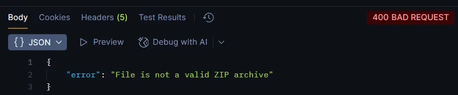
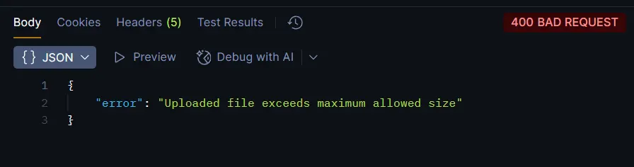
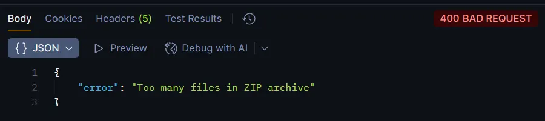
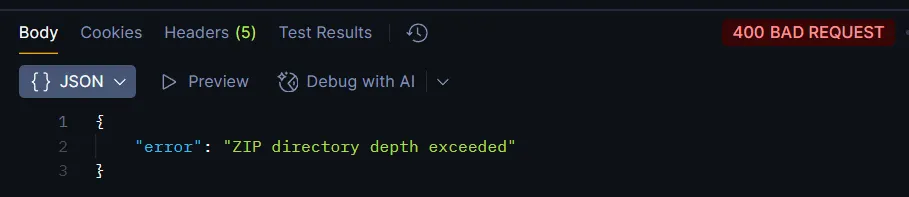
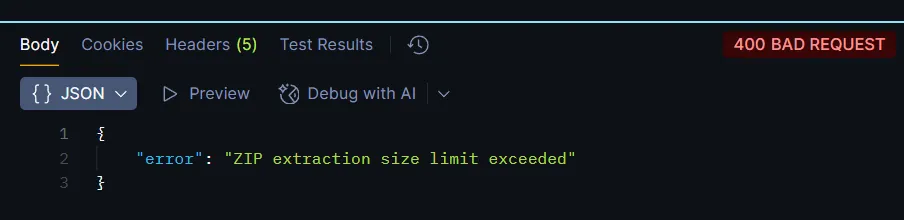
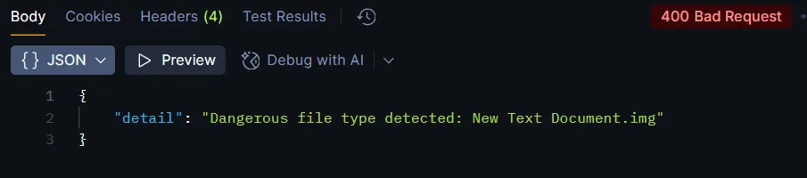

# ZIP Upload

- **Non-ZIP File (Signature Check) :**
    - Risk Description : Attackers may upload files that are **not real ZIP archives** (e.g., scripts or executables) but rename them with a `.zip` extension to bypass basic checks.
    - Potential Impact :
        - Unexpected file parsing behavior
        - Application crashes
        - Possibility of malicious payload processing
    - Mitigation Implemented : The system validates the **ZIP magic signature** (`PK`) before processing the file, ensuring the uploaded file is a genuine ZIP archive and not just a renamed file.

    
        
- **Oversized Upload :**
    - Risk Description : An attacker may attempt to upload an extremely large file to exhaust server memory or disk resources.
    - Potential Impact
        - Denial of Service (DoS)
        - Server instability or crashes
    - Mitigation Implemented : A strict maximum upload size (`MAX_UPLOAD_BYTES`) is enforced immediately after reading the file.

    
        
- **Too Many Files:**
    - Risk Description : A ZIP archive may contain **thousands of small files**, overwhelming the filesystem even if the total size is small.
    - Potential Impact
        - Inode exhaustion
        - Performance degradation
        - Denial of Service
    - Mitigation Implemented : The system limits the maximum number of files allowed in a ZIP archive (`MAX_FILES`) before extraction begins.

    

- **Directory Depth Limit:**
    - Risk Description : Deeply nested directory structures can be used to stress filesystem traversal or bypass naive validation logic.
    - Potential Impact
        - Filesystem performance issues
        - Stack or recursion-related failures
        - Increased attack surface
    - Mitigation Implemented : Each ZIP entry’s directory depth is calculated, and archives exceeding the allowed depth (`MAX_DEPTH`) are rejected.

    
        
- **Path Traversal Attack:**
    - Risk Description : An attacker may include file paths such as `../../etc/passwd` inside a ZIP to write files **outside the intended extraction directory**.
    - Potential Impact
        - Overwriting system or application files
        - Data leakage
        - Privilege escalation
    - Mitigation Implemented : All extraction paths are resolved and validated to ensure they remain strictly within the job’s source directory. Any path traversal attempt results in immediate rejection.
        
    
        
- **Symlink Attack (Linux/macOS) :**
    - Risk Description : A ZIP file may contain **symbolic links** pointing to sensitive files outside the extraction directory.
    - Potential Impact
        - Unauthorized access to system files
        - File overwrite via symlink redirection
        - Full filesystem escape
    - Mitigation Implemented : The system inspects ZIP metadata to detect Unix symbolic links and rejects any archive containing them.
- **ZIP Bomb (Uncompressed Size Assurance):**
    - Risk Description : A ZIP bomb is a small compressed file that expands into an extremely large amount of data when extracted.
    - Potential Impact
        - Disk exhaustion
        - Denial of Service
        - Application failure
    - Mitigation Implemented : The total uncompressed size of ZIP entries is tracked during inspection, and extraction is aborted if it exceeds the configured limit (`MAX_UNCOMPRESSED_BYTES`).
        
    
        
- **Dangerous Content Inside ZIP Archives :**
    - Risk Description: Attackers may include precompiled binaries or executable files inside a ZIP archive to introduce malicious payloads or bypass later security controls.
    - Potential Impact:
        - Execution of malicious binaries
        - Supply-chain compromise
        - Platform integrity violations
    - Mitigation Implemented: All extracted files are inspected by extension. Known dangerous or executable file types (e.g. `.exe`, `.dll`, `.so`, `.jar`, `.class`, `.bin`, `.rpm`, `.deb`) are strictly forbidden during Phase 1. Any ZIP archive containing such files is rejected.
        
    
        

# GitHub Repository Cloning

- **GitHub URL Validation :**
    - Only `https` URLs are accepted
    - Only the `github.com` domain is allowed
    - The path must match the format:
    - **Risk Mitigated** : Restricts cloning strictly to **public GitHub repositories** using HTTPS.
    
    ```arduino
    https://github.com/{owner}/{repo}
    ```
    
- **Shallow Clone (`--depth`) :**
    - Only the latest commit is cloned
    - Full commit history is excluded
    - **Risk Mitigated** : Disk exhaustion and long clone times
- **Single Branch Clone :**
    - Only the default branch is cloned
    - All other branches are ignored
    - **Risk Mitigated** : Unnecessary data exposure and resource usage
- **Tag Download Disabled :**
    - A **Git tag** is a **named pointer to a specific commit** in a repository.
    - **Risk Mitigated** : Repository bloat and unexpected payloads
- **Clone Timeout Enforcement :**
    - Clone operation must complete within a fixed time window
    - **Risk Mitigated** : Denial-of-Service (DoS) via slow or hanging clones
- **Removal of `.git` Directory :**
    - Removes Git metadata after cloning
    - **Risk Mitigated** : Execution of Git hooks and metadata abuse
- **GitHub Repository Size & Structure Bounding:**
    - Risk Description**:** A GitHub repository may contain excessive files, deeply nested directories, or very large files that exhaust disk space or degrade system performance.
    - Potential Impact**:**
        - Disk exhaustion
        - Filesystem performance degradation
        - Denial of Service
    - Mitigation Implemented: After cloning, the repository is recursively scanned and enforced against the same limits as ZIP uploads:
        - Maximum number of files (`MAX_FILES`)
        - Maximum total size (`MAX_UNCOMPRESSED_BYTES`)
        - Maximum directory depth (`MAX_DEPTH`)
        
        Repositories exceeding any limit are rejected and fully cleaned up.
        
- **Dangerous Content Inside GitHub Repositories:**
    - Risk Description: Public GitHub repositories may contain precompiled executables or binary payloads intended to be executed during later pipeline stages.
    - Potential Impact:
        - Remote code execution
        - Supply-chain compromise
        - Bypass of build-time controls
    - Mitigation Implemented: All cloned repository files are inspected. The same dangerous file extension blacklist used for ZIP uploads is enforced. Any repository containing forbidden executable or binary files is rejected during Phase 1.