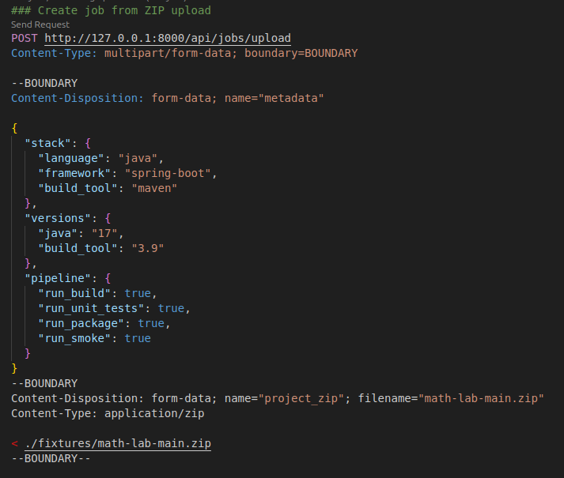
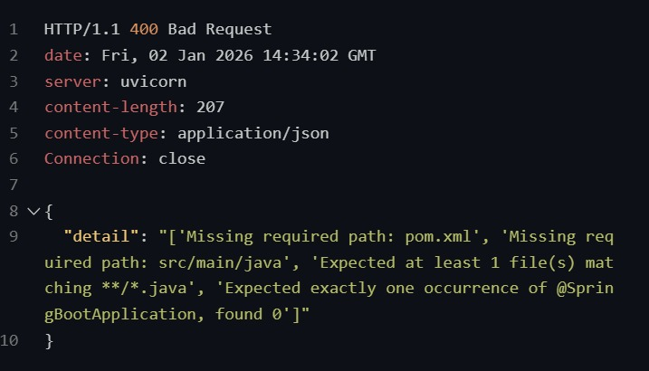
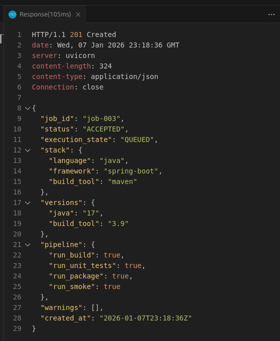
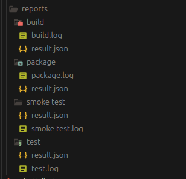

# pipelineX workflow (cas spring boot maven)

- Un formulaire est fourni à l’utilisateur pour sélectionner d’abord un framework supporté (selon une structure de projet que nous prenons en charge), puis définir les étapes du pipeline souhaitées (build, package, test, smoke-test, SAST, SCA, secrets, DAST). L’utilisateur fournit ensuite soit un fichier ZIP, soit un lien vers un dépôt GitHub (avec l’option future d’un lien Docker Hub).



- Les inputs sont d’abord vérifiés au niveau sécurité : absence de fichiers exécutables, protection contre les ZIP explosifs, limitation de la taille maximale, du nombre de fichiers et de la profondeur des dossiers.



- Si aucun risque n’est détecté, le projet est extrait et sa structure est validée selon des guidelines que nous définissons (formes canoniques par framework).  
  Exemple : pour un projet Spring Boot, une seule classe annotée `@SpringBootApplication` est requise.  
  Le projet reçoit ensuite un statut : `accepted` ou `accepted_with_issues` (ex. : tests demandés mais aucun test présent dans `src/`).


- Après validation de la structure, un fichier `metadata.json` est généré contenant les informations nécessaires (framework, versions des dépendances, étapes du pipeline sélectionnées, etc.).



- Un workspace est ensuite créé, contenant :
  - `source/` : code source de l’application  
  - `pipelines/*.sh` : scripts de pipeline adaptés au projet  
  - `reports/` : vide initialement  
  - `metadata.json` :  generer d'apres l input de l utilisateur 
  - `state.json` contenant l’état du pipeline à un moment donné
  - La possession du workspace est ensuite transférée à un utilisateur non-root, avec une limitation des permissions
```bash
sudo chown -R 10001:10001 workspaces/<job-id>
sudo chmod -R u+rwx workspaces/<job-id>
sudo chmod +x workspaces/<job-id>/pipelines/*.sh
```

- Une tâche Celery est créée pour traiter la requête ; elle effectue les opérations suivantes :
  - Choisit le runner approprié en se basant sur le `metadata.json`, le runner étant un environnement Docker contenant les dépendances nécessaires à l’exécution du projet.
  - Lance le conteneur à partir du runner en attachant le workspace.
  - À l’intérieur du conteneur (environnement isolé), exécute les pipelines selon un ordre logique prédéfini et génère les rapports (SUCCESS / FAILURE) ainsi que les logs de chaque étape du pipeline.

> `runners/java17maven3.9`

```Dockerfile
FROM eclipse-temurin:17-jdk-jammy

# ---------- system deps ----------
RUN apt-get update && \
    apt-get install -y --no-install-recommends \
        curl \
        unzip \
        ca-certificates \
        bash && \
    rm -rf /var/lib/apt/lists/*

# ---------- maven install ----------
ENV MAVEN_VERSION=3.9.12
ENV MAVEN_HOME=/opt/maven
ENV PATH=$MAVEN_HOME/bin:$PATH

RUN curl -fsSL https://repo.maven.apache.org/maven2/org/apache/maven/apache-maven/3.9.12/apache-maven-3.9.12-bin.zip \
    -o /tmp/maven.zip && \
    unzip /tmp/maven.zip -d /opt && \
    mv /opt/apache-maven-3.9.12 ${MAVEN_HOME} && \
    rm /tmp/maven.zip

# ---------- non-root user ----------
RUN useradd -m -u 10001 runner
USER runner
WORKDIR /home/runner

CMD ["bash"]
```
> lancement du conteneur 
```bash
docker run --rm -it \
  -u 10001:10001 \
  -v workdir/<job-id>/app:/home/runner/app:rw \
  -v workdir/<job-id>/pipelines:/home/runner/pipelines:ro \
  -v workdir/<job-id>/reports:/home/runner/reports:rw \
  -w /home/runner \
  abderrahmane03/pipelinex:java17-mvn3.9.12-latest
```

>reports/ 



- Un fichier `state.json` est mis à jour en continu pour refléter l’état du pipeline, permettant le rafraîchissement du frontend.

```json
{
  "state": "SUCCEEDED",
  "current_stage": null,
  "updated_at": "2026-01-08T12:15:47.903Z",
  "stages": {
    "SECRETS": {
      "status": "SUCCESS"
    },
    "BUILD": {
      "status": "SUCCESS"
    },
    "TEST": {
      "status": "SUCCESS"
    },
    "SAST": {
      "status": "SUCCESS"
    },
    "SCA": {
      "status": "SUCCESS"
    },
    "PACKAGE": {
      "status": "SUCCESS"
    },
    "SMOKE-TEST": {
      "status": "SUCCESS"
    },
    "DAST": {
      "status": "SUCCESS"
    }
  }
}

```

- À la fin, l’UI retourne à l’utilisateur l’état de chaque étape avec des logs minimalistes, ainsi qu’une archive ZIP des reports pour une analyse détaillée.
